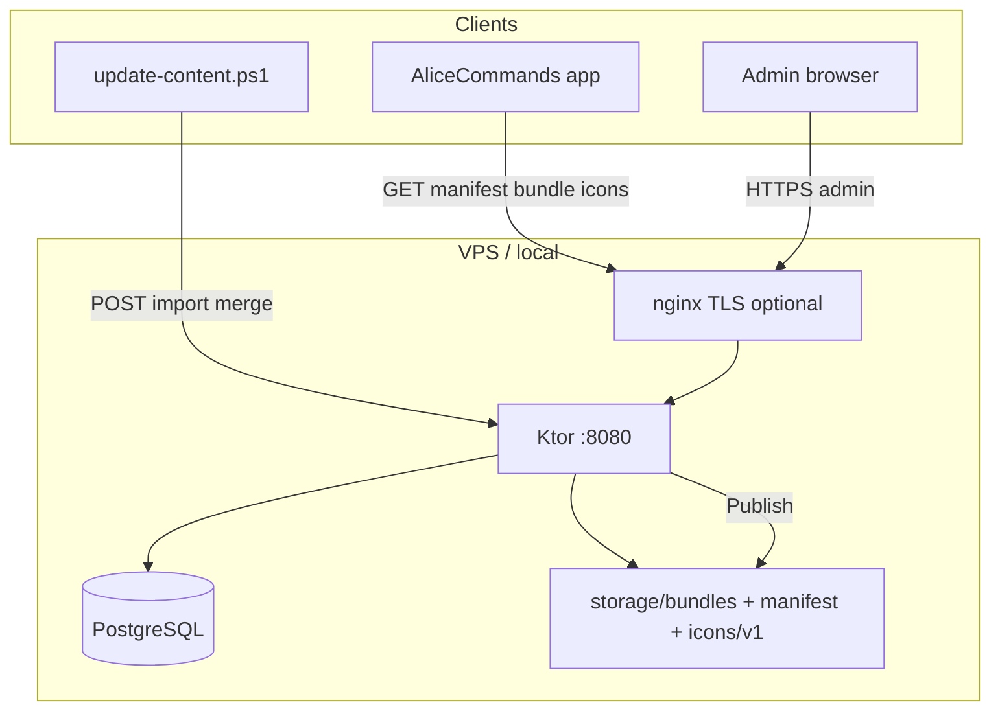
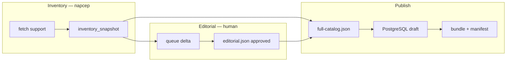

# Architecture — alice-commands-api

**mob_id:** MOB-20260626-001 · **v1.0 + schema v2 (реализовано)**  
**Стиль:** **Light Clean (hexagonal light)** — Android app использует **Full Clean** (отдельный repo).

---

## 1. Stack

| Компонент | Версия / выбор | Примечание |
| --------- | -------------- | ---------- |
| Language | Kotlin 2.1 | JVM 21 |
| HTTP | Ktor 3.1 (CIO) | Compression, call logging |
| DB | PostgreSQL 16 | Docker Compose для local |
| ORM | Exposed 0.57 | Только `infrastructure.persistence` |
| Migrations | Flyway 11 | V1 init … **V5 category_visuals** |
| Serialization | kotlinx.serialization | Bundle + API DTO |
| Validation | networknt JSON Schema | `:server:validateContent` |
| Admin UI | Static HTML + Alpine.js | `admin-web/` → classpath `/admin` |
| Build | Gradle KTS | Модуль `server` |
| Tests | JUnit 5 + Testcontainers | Integration с PostgreSQL |

### 1.1 Light Clean Architecture

**Dependency rule:** domain/application **не** импортирует Ktor, Exposed, filesystem paths.

```
routes (Ktor)  →  application  →  ports (interfaces)  ←  infrastructure
```

| Зона | Пакет | Clean-строгость |
| ---- | ----- | --------------- |
| Publish, rollback, import, preview | `application/publish/` | Full use cases |
| Public read (manifest, bundle, affiliate) | `application/read/` | Thin services |
| Diff import vs published | `application/read/ContentDiffService` | Service (+ `command_groups`) |
| **Delta published vN→current** | `application/read/ContentDeltaService` | Service |
| **Group validation (publish gate)** | `application/publish/CommandGroupValidationUseCase` | Use case |
| **Category visuals (publish gate)** | `application/publish/CategoryVisualValidationUseCase`, `SvgIconValidator` | Use case |
| **Icon upload / catalog** | `application/publish/UploadIconUseCase`, `IconCatalogService` | Use cases |
| **App feedback inbox** | `application/feedback/` | Use cases (submit, list, resolve) |
| Admin CRUD | `routes` → `DraftRepository` | Прямой repo OK |
| HTTP / auth / DTO | `routes/`, `plugins/` | Adapters only |

**Фактическая структура `server/src/main/kotlin/ru/appforsale/alicecommands/api/`:**

```
├── Application.kt, AppDependencies.kt
├── config/AppConfig.kt
├── routes/
│   ├── PublicRoutes.kt      # /v1/*, /health, /ready
│   ├── FeedbackRoutes.kt    # POST /v1/feedback, /v1/commands/report
│   ├── AdminRoutes.kt       # /admin/api/*
│   └── AdminAuth.kt         # session cookie guard
├── application/
│   ├── BundleCodec.kt
│   ├── publish/PublishUseCases.kt, CommandGroupValidationUseCase.kt, CategoryVisualValidationUseCase.kt, IconCatalogUseCases.kt
│   ├── read/ReadServices.kt, ContentDiffService.kt, ContentDeltaService.kt
│   └── feedback/FeedbackUseCases.kt
├── domain/
│   ├── Models.kt
│   └── ports/Ports.kt, IconStoragePorts.kt, HealthProbe.kt
├── infrastructure/
│   ├── persistence/         # Exposed tables + repositories
│   ├── storage/FilesystemBundleStorage.kt, FilesystemIconStorage.kt
│   ├── security/            # SessionSigner, LoginRateLimiter, ClientIpResolver
│   └── validation/JsonSchemaValidator.kt
├── plugins/Serialization.kt, StatusPages.kt
└── tools/ValidateContentMain.kt
```

**MUST / MUST NOT** — см. [AGENTS.md](../AGENTS.md).

---

## 2. Модули репозитория

```
alice-commands-api/
├── server/              # Ktor: public + admin API + publish logic
├── admin-web/           # Static assets (копируются в build/resources/main/admin)
├── schema/              # JSON Schema (shared contract)
├── seed/                # Dev / pipeline JSON
├── tools/content/       # Python fetch → parse → build_bundle
├── scripts/             # PowerShell automation (staging)
├── deploy/              # systemd, nginx, remote-setup.sh
└── docs/
```

Publish-логика (gzip, sha256, manifest) живёт в `server/application/`, не в отдельном Gradle-модуле. Каталог `publish/` — placeholder для возможного выделения v1.0.1.

---

## 3. Diagram



---

## 4. Ktor route groups

| Prefix | Auth | Назначение |
| ------ | ---- | ---------- |
| `/v1/content/*` | Public | manifest, bundle, bundle-backup, **delta** |
| `/icons/v1/*.svg` | Public | Category/group SVG (nginx static + Ktor fallback) |
| `/v1/affiliate/*` | Public | blocks (из published storage) |
| `/v1/feedback`, `/v1/commands/report` | Public (rate limited) | App feedback + command reports |
| `/admin/api/*` | Session cookie | CRUD, publish, import, content/pipeline, docs |
| `/admin/*` | Static (login в SPA) | Admin UI |
| `/health`, `/ready` | Public | ops |

---

## 5. Publish flow

```kotlin
// application/publish/PublishContentUseCase
suspend fun execute(adminUser, minAppVersion, notes): PublishResult {
    val draft = draftRepository.loadFull()  // schema_version = 2
    commandGroupValidation.validate(draft)  // publish gate
    schemaValidator.validate(draft)
    val gzip = bundleCodec.toGzipJson(draft)
    // … write bundle, manifest, affiliate, prune retention 5
}
```

Rollback переключает `current_manifest` на существующий файл из history (retention 5).

---

## 6. Content pipeline (offline)



Auto-publish **не** выполняется. См. [CONTENT-UPDATE.md](CONTENT-UPDATE.md).

---

## 6.1 Icon assets (category / group visuals)

```
content/icons/v1/*.svg          # pilot в репо
        │ deploy-staging.ps1
        ▼
/opt/alice-api/storage/icons/v1/
        │
        ├── nginx /icons/  (staging-api + cdn vhost)
        └── Ktor staticFiles fallback
        │
        ▼
icon_url в bundle ← ICON_PUBLIC_BASE_URL + /icons/v1/{slug}.svg
```

Port: `IconStorage` → `FilesystemIconStorage`. Upload: `UploadIconUseCase` + `SvgIconValidator`. Полный контракт: [BACKEND-CATEGORY-VISUALS.md](BACKEND-CATEGORY-VISUALS.md).

---

## 7. Масштабирование

| Установки | Поведение |
| --------- | --------- |
| 0–100k | Один VPS Selectel 2 GB, nginx + Let's Encrypt, DNS only (без CF CDN в РФ) |
| 100k–500k | Тот же VPS; optional CDN **не** Cloudflare proxy для RU |
| >500k | Object storage + CDN; delta sync уже в API (app opt-in) |

Mobile clients **не** бьют в PostgreSQL — только manifest + bundle.

---

## 8. Shared schema с Android

- Канон: [`schema/content-bundle.schema.json`](../schema/content-bundle.schema.json) — **v2** (`command_groups[]`, group fields on commands)
- CI: [`.github/workflows/validate-content.yml`](../.github/workflows/validate-content.yml) на PR/push
- Процедура bump: [SCHEMA-SYNC.md](SCHEMA-SYNC.md)

---

## 9. Local dev

```powershell
docker compose up -d
Copy-Item .env.example .env
.\gradlew.bat :server:test
.\gradlew.bat :server:run
# http://localhost:8080/admin
```

В `APP_ENV=local` admin static served из `admin-web/` (hot reload без rebuild).

В staging/prod admin встроен в JAR: Gradle `copyAdminWeb` → classpath `admin/`; Ktor отдаёт через `staticResources` (fallback `admin-web/` только если каталог существует на диске).

---

*См. [BACKEND-REQUIREMENTS.md](BACKEND-REQUIREMENTS.md), [DATABASE.md](DATABASE.md)*
