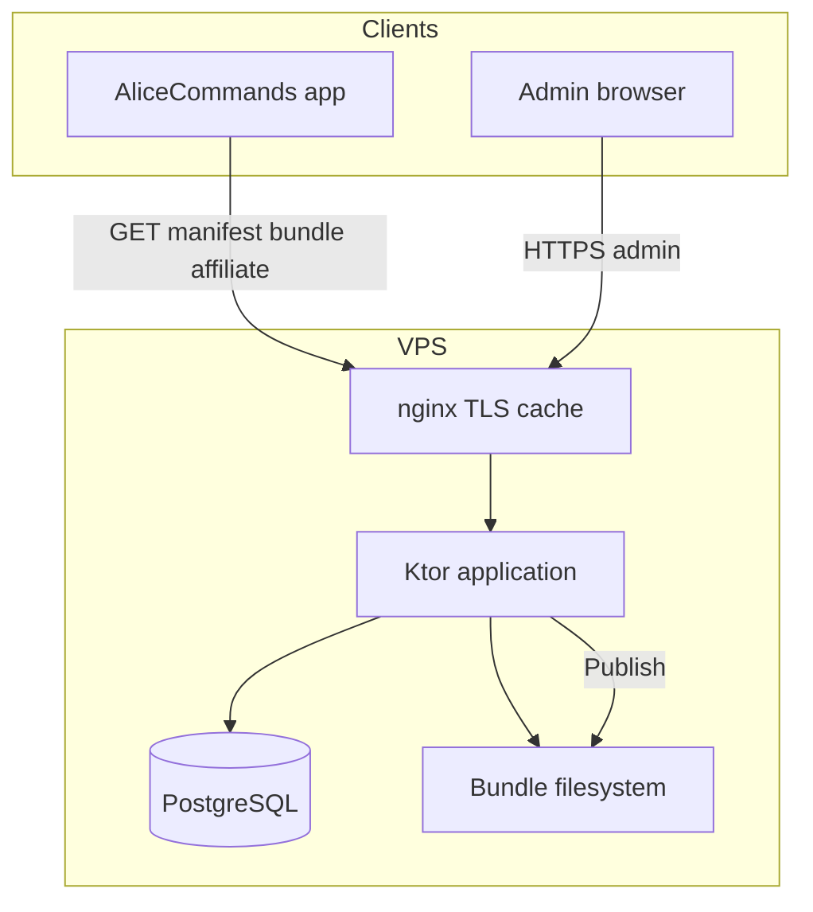

# Architecture — alice-commands-api

**mob_id:** MOB-20260626-001 · **v1.0**

---

## 1. Stack

| Компонент | Выбор | Почему |
| --------- | ----- | ------ |
| Language | **Kotlin 2.x** | Тот же стек, что Android |
| HTTP | **Ktor 3** (CIO engine) | Легче Spring; ИИ-friendly |
| DB | **PostgreSQL 16** | Надёжность, JSON fields при необходимости |
| ORM | **Exposed** | Kotlin-native |
| Migrations | **Flyway** | Версионирование SQL |
| Serialization | **kotlinx.serialization** | Совместимость с Android |
| Admin UI | **Static HTML + Alpine.js** | Минимум фронта, Ktor serves `/admin` |
| Build | **Gradle KTS** (multi-module позже) |

---

## 2. Модули (целевая структура)

```
alice-commands-api/
├── server/          # Ktor: public + admin API + static admin
├── publish/         # BundleBuilder, ManifestWriter, Gzip, Sha256
├── schema/          # JSON Schema (shared contract)
├── admin-web/       # Static assets (HTML/JS/CSS)
├── seed/            # Import JSON для dev
└── docs/
```

**v1.0 implementation:** можно начать с single-module `server/` включая publish logic.

---

## 3. Diagram



---

## 4. Ktor route groups

| Prefix | Auth | Назначение |
| ------ | ---- | ---------- |
| `/v1/content/*` | Public | manifest, bundle |
| `/v1/affiliate/*` | Public | blocks |
| `/admin/api/*` | Session | CRUD, publish, preview |
| `/admin/*` | Session | Static admin UI |
| `/health` | Public | ops |

---

## 5. Publish flow (server)

```kotlin
// Псевдокод
suspend fun publish(adminUser: String): PublishResult {
    val draft = contentRepository.loadFullDraft()
    jsonSchemaValidator.validate(draft)
    val json = bundleSerializer.toJson(draft)
    val gzip = gzip(json)
    val sha = sha256(gzip)
    val version = manifestRepository.nextVersion()
    val path = storage.write("content_v$version.json.gz", gzip)
    manifestRepository.update(version, path, sha, draft.minAppVersion)
    publishHistory.insert(version, sha, adminUser)
    storage.pruneOldBundles(retention = 5)
}
```

---

## 6. Масштабирование

| Установки | Поведение |
| --------- | --------- |
| 0–100k | Один VPS 2–4 GB, nginx cache bundle |
| 100k–500k | Cloudflare cache + тот же VPS |
| >500k | Object storage + CDN; delta sync (v1.0.1) |

Mobile clients **не** бьют в PostgreSQL — только manifest + bundle.

---

## 7. Shared schema с Android

- Канон: [`schema/content-bundle.schema.json`](../schema/content-bundle.schema.json)
- App repo: копия или submodule (обновлять при bump `schema_version`)
- CI обоих репо: validate seed/bundle against schema

---

## 8. Local dev

```bash
docker compose up -d          # PostgreSQL
cp .env.example .env
./gradlew :server:run         # после реализации
open http://localhost:8080/admin
```

---

*См. [BACKEND-REQUIREMENTS.md](BACKEND-REQUIREMENTS.md), [DATABASE.md](DATABASE.md)*
