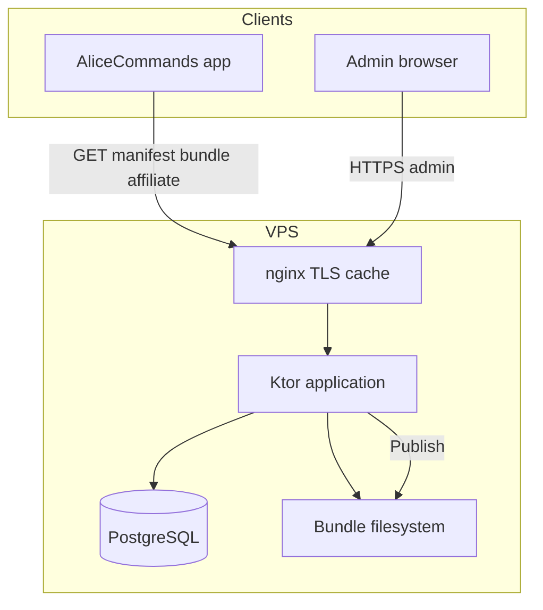

# Architecture — alice-commands-api

**mob_id:** MOB-20260626-001 · **v1.0**  
**Стиль:** **Light Clean (hexagonal light)** — Android app использует **Full Clean** (отдельный repo).

---

## 1. Stack

| Компонент | Выбор | Почему |
| --------- | ----- | ------ |
| Language | **Kotlin 2.x** | Тот же стек, что Android |
| HTTP | **Ktor 3** (CIO engine) | Легче Spring; ИИ-friendly |
| DB | **PostgreSQL 16** | Надёжность, JSON fields при необходимости |
| ORM | **Exposed** | Kotlin-native |
| Migrations | **Flyway** | Версионирование SQL |
| Serialization | **kotlinx.serialization** | Совместимость с Android |
| Admin UI | **Static HTML + Alpine.js** | Минимум фронта, Ktor serves `/admin` |
| Build | **Gradle KTS** (multi-module позже) |

### 1.1 Light Clean Architecture

**Dependency rule:** domain/application **не** импортирует Ktor, Exposed, filesystem paths.

```
routes (Ktor)  →  application  →  ports (interfaces)  ←  infrastructure
```

| Зона | Где | Clean-строгость |
| ---- | --- | --------------- |
| **Publish, rollback, import, preview** | `application/publish/` + ports | **Full use cases** |
| **Public read** (manifest, bundle, affiliate) | `application/read/` | Thin service, без use case на каждый GET |
| **Admin CRUD** | `routes` → `repository` (Exposed) | Прямой repo OK; без logic в routes |
| **HTTP / auth / DTO** | `routes/`, `plugins/` | Adapters only |

**Структура `server/` (целевая):**

```
server/src/main/kotlin/.../
├── routes/           # Ktor routing — thin: parse, auth, status, call application
├── application/
│   ├── publish/      # PublishContentUseCase, RollbackPublishUseCase, ImportJsonUseCase
│   └── read/         # ManifestService, BundleService, AffiliateService
├── domain/           # Draft models (pure Kotlin), port interfaces
├── infrastructure/
│   ├── persistence/  # Exposed tables, *Repository impl
│   ├── storage/      # BundleStorage (filesystem; S3 adapter v1.0.1)
│   └── validation/   # JsonSchemaValidator
└── plugins/          # Auth, serialization, status pages
```

**MUST:**

1. Publish / rollback / import — **только** через `application.publish.*UseCase`.
2. Public API читает **published files**, не draft tables напрямую (кроме affiliate sync при publish).
3. Routes — без business logic (validate, sha256, version bump — не здесь).
4. Exposed `Table` / SQL — только `infrastructure.persistence`.

**MUST NOT:**

- Править `content_v*.json.gz` на диске в обход publish use case
- `routing { }` с validate → gzip → manifest update inline
- Draft CRUD из public `/v1/*` routes

См. также [AGENTS.md](../AGENTS.md).

---

## 2. Модули (целевая структура)

```
alice-commands-api/
├── server/          # Ktor: public + admin API + static admin
├── publish/         # BundleBuilder, ManifestWriter, Gzip, Sha256
├── schema/          # JSON Schema (shared contract)
├── admin-web/       # Static assets (HTML/JS/CSS)
├── seed/            # Import JSON для dev
└── docs/
```

**v1.0 implementation:** можно начать с single-module `server/` включая publish logic.

---

## 3. Diagram



---

## 4. Ktor route groups

| Prefix | Auth | Назначение |
| ------ | ---- | ---------- |
| `/v1/content/*` | Public | manifest, bundle |
| `/v1/affiliate/*` | Public | blocks |
| `/admin/api/*` | Session | CRUD, publish, preview |
| `/admin/*` | Session | Static admin UI |
| `/health` | Public | ops |

---

## 5. Publish flow (application layer)

```kotlin
// application/publish/PublishContentUseCase — не в route handler
suspend fun execute(adminUser: String): PublishResult {
    val draft = draftRepository.loadFull()
    schemaValidator.validate(draft)
    val json = bundleSerializer.toJson(draft)
    val gzip = gzip(json)
    val sha = sha256(gzip)
    val version = manifestRepository.nextVersion()
    val path = bundleStorage.write("content_v$version.json.gz", gzip)
    manifestRepository.update(version, path, sha, draft.minAppVersion)
    publishHistory.insert(version, sha, adminUser)
    bundleStorage.pruneOldBundles(retention = 5)
}
```

---

## 6. Масштабирование

| Установки | Поведение |
| --------- | --------- |
| 0–100k | Один VPS 2–4 GB, nginx cache bundle |
| 100k–500k | Cloudflare cache + тот же VPS |
| >500k | Object storage + CDN; delta sync (v1.0.1) |

Mobile clients **не** бьют в PostgreSQL — только manifest + bundle.

---

## 7. Shared schema с Android

- Канон: [`schema/content-bundle.schema.json`](../schema/content-bundle.schema.json)
- App repo: копия или submodule (обновлять при bump `schema_version`)
- CI обоих репо: validate seed/bundle against schema

---

## 8. Local dev

```bash
docker compose up -d          # PostgreSQL
cp .env.example .env
./gradlew :server:run         # после реализации
open http://localhost:8080/admin
```

---

*См. [BACKEND-REQUIREMENTS.md](BACKEND-REQUIREMENTS.md), [DATABASE.md](DATABASE.md)*
