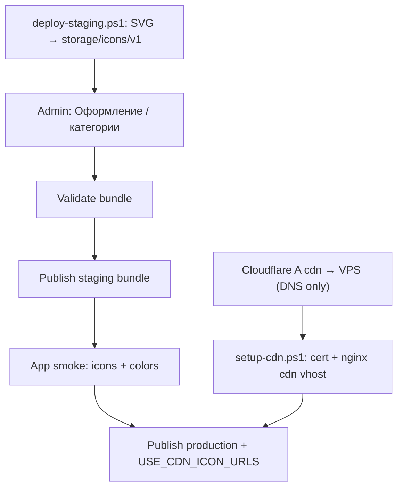

# Backend Plan — Category & Group Visuals (icons + colors)

**mob_id:** MOB-20260626-001 · **Дата:** 2026-07-01 · **Статус:** реализовано в alice-commands-api

Цель: дать app **удалённо управляемые** иконки и цвета для категорий и групп команд **без релиза APK** — через те же `manifest` + `bundle`, без новых REST-ручек.

Связанный app-план: [`APP-CATEGORY-VISUALS.md`](APP-CATEGORY-VISUALS.md).

Backend repo: [`alice-commands-api`](https://github.com/MironBano/alice-commands-api). При работе в backend-проекте синхронизировать с `docs/API.md`, `docs/BACKEND-REQUIREMENTS.md`, `docs/RUNBOOK-PUBLISH.md`.

---

## 1. Why

| Сейчас | Проблема |
| ------ | -------- |
| `icon_key` в bundle | App знает только зашитый маппинг; новая иконка = релиз APK |
| Нет полей цвета | Все категории одинаково teal; не как в design-refs |
| Иконки «в тему» в референсах | Editorial не может менять визуал с админки |

Нужно:

- менять иконку категории/группы publish'ем bundle;
- задавать accent-цвет hex с бэкенда;
- сохранить `icon_key` как offline-fallback для старых и новых app;
- **не** ломать текущий content pipeline (`manifest` → `bundle` → CDN).

---

## 2. Contract Shift (additive)

**Новых endpoints нет.** Расширяем объекты в существующем bundle.

| Сейчас | Добавляем (все optional) |
| ------ | -------------------------- |
| `categories[].icon_key` | `icon_url`, `accent_color`, `accent_color_dark` |
| `command_groups[].icon_key` | те же поля; fallback на category |

`schema_version` **не поднимать** для visuals-only (поля optional, backward compatible). Если параллельно идёт schema v2 groups — visuals живут в том же bundle.

### Пример

```json
{
  "id": "music",
  "title_ru": "Музыка",
  "sort_order": 3,
  "icon_key": "music_note",
  "icon_url": "https://cdn.alicecommands.ru/icons/v1/music_note.svg",
  "accent_color": "#7B4BB7",
  "accent_color_dark": "#C9A8F0",
  "description_ru": "Включение, пауза, громкость",
  "source_url": "https://alice.yandex.ru/support/ru/station/skills/",
  "device_types": ["station", "phone"],
  "featured": true
}
```

```json
{
  "id": "smart_home_light",
  "category_id": "smart_home",
  "title_ru": "Свет",
  "sort_order": 10,
  "icon_key": "lightbulb",
  "icon_url": "https://cdn.alicecommands.ru/icons/v1/lightbulb.svg",
  "accent_color": "#E8A317",
  "accent_color_dark": "#F5C842"
}
```

**Команды** (`commands[]`) — **без** visual-полей.

---

## 3. Field Semantics

### Общие правила

| Поле | Тип | Обяз. | Описание |
| ---- | --- | ----- | -------- |
| `icon_key` | string? | no | Локальный fallback в app; рекомендуется всегда заполнять |
| `icon_url` | string? | no | HTTPS URL монохромного SVG на CDN; приоритет над `icon_key` в новом app |
| `accent_color` | string? | no | Hex `#RRGGBB` для light theme (фон иконки + tint) |
| `accent_color_dark` | string? | no | Hex для dark theme; если пусто — app выводит из `accent_color` |

### Приоритет в app (контракт)

```
icon_url  → Coil (кэш)
else icon_key → локальный реестр
else → default Category icon

accent_color_dark ?? derive(accent_color) ?? theme default
```

### Группы

- Если у группы visual-поля пусты → наследование от родительской `category`.
- Группа может переопределить только `icon_url` / `icon_key`, оставив цвет категории.

---

## 4. CDN & Icon Assets

### Layout

```
https://cdn.alicecommands.ru/icons/v1/{slug}.svg
```

- `{slug}` = snake_case, латиница: `music_note`, `home_iot`, `lightbulb`.
- Один файл = одна иконка; смена файла по тому же URL → app подхватит после invalidation кэша Coil (TTL / cache-bust query при необходимости).

### Требования к SVG

| Правило | Значение |
| ------- | -------- |
| Формат | SVG 1.1, single path preferred |
| ViewBox | `0 0 24 24` |
| Цвет | `currentColor` / монохром (tint задаёт app) |
| Размер файла | ≤ 4 KB |
| Стиль | Material-like, flat, без бренда Яндекса |

### Хранение (реализация)

| Слой | Путь / компонент |
| ---- | ---------------- |
| Диск VPS | `ICON_STORAGE_PATH/v1/{slug}.svg` (default `/opt/alice-api/storage/icons/v1/`) |
| Репо (pilot) | `content/icons/v1/*.svg` — копируются при `deploy-staging.ps1` |
| Отдача | nginx static `/icons/` + Ktor `staticFiles` fallback |
| PostgreSQL | Только `icon_url` (HTTPS), не бинарник |
| Publish | `FilesystemIconStorage` + `UploadIconUseCase` + `CategoryVisualValidationUseCase` |

**Не** S3 на v1.0 — один VPS Selectel; prod CDN subdomain (`cdn.alicecommands.ru`) — тот же диск, отдельный nginx vhost. Cloudflare **DNS only** (без orange proxy) для доступа из РФ.

### URL по средам

| Среда | `ICON_PUBLIC_BASE_URL` | Пример |
| ----- | ---------------------- | ------ |
| Local | `http://localhost:8080` | `http://localhost:8080/icons/v1/music_note.svg` |
| Staging | `https://staging-api.alicecommands.ru` | зеркало на API-хосте |
| Prod | `https://cdn.alicecommands.ru` | отдельный vhost (после DNS A + certbot) |

Скрипты: `scripts/setup-cdn.ps1`, `scripts/publish-staging-visuals.ps1` (`USE_CDN_ICON_URLS=1` для cdn host в bundle).

### Admin upload flow

1. Редактор выбирает/загружает SVG.
2. Backend валидирует (размер, viewBox, no script tags).
3. Сохраняет на CDN, возвращает `icon_url`.
4. Автозаполняет `icon_key` из slug файла, если не задан.

---

## 5. Validation Rules (publish)

Добавить к существующему validator:

1. `icon_url` — только `https://`, host из allowlist (`cdn.alicecommands.ru`, staging mirror).
2. `icon_url` path должен начинаться с `/icons/v1/`.
3. `accent_color` / `accent_color_dark` — regex `^#[0-9A-Fa-f]{6}$`.
4. Контраст preview (admin warning, не hard fail): luminance icon tint vs container ≥ 3:1.
5. Если задан `icon_url` без `icon_key` — warning; рекомендация заполнить fallback.
6. Команды — visual-поля запрещены (reject if present).
7. Bundle gzip size лимит из [`CONTENT-SCHEMA.md`](CONTENT-SCHEMA.md) не превышен.

---

## 6. Storage / Admin Changes

### PostgreSQL (draft model)

Таблица `categories` — колонки:

- `icon_url TEXT NULL`
- `accent_color VARCHAR(7) NULL`
- `accent_color_dark VARCHAR(7) NULL`

Таблица `command_groups` — те же три колонки.

`icon_key` уже есть или добавляется вместе с groups schema.

### Admin UI

| Экран | Функция |
| ----- | ------- |
| **Оформление** (`category-visuals`) | Таблица всех категорий: цвета, icon_url, превью, сохранить |
| Category edit | Color picker → hex; preview light/dark |
| Category edit | Icon: upload SVG **или** выбор из каталога slug |
| Category edit | Live preview карточки |
| Group edit | То же; toggle «наследовать от категории» |
| Icon library | Список SVG на сервере + upload |

### Icon catalog (справочник, не API)

Файл в backend repo: `content/icon_catalog.json`

```json
{
  "icons": [
    { "slug": "music_note", "label_ru": "Музыка" },
    { "slug": "home_iot", "label_ru": "Умный дом" }
  ],
  "accent_presets": [
    { "name": "teal", "light": "#1B6B5A", "dark": "#4DB6A0" },
    { "name": "violet", "light": "#7B4BB7", "dark": "#C9A8F0" }
  ]
}
```

Поле `url` в JSON **не обязательно** — API `GET /admin/api/icons/catalog` подставляет `{ICON_PUBLIC_BASE_URL}/icons/v1/{slug}.svg` и возвращает `public_base_url`.

---

## 7. API Contract

**Без изменений путей.**

| Method | Path | Change |
| ------ | ---- | ------ |
| GET | `/v1/content/manifest` | Без изменений |
| GET | `/v1/content/bundle` | Optional visual fields в `categories[]`, `command_groups[]` |
| GET | `/v1/content/delta?from={v}` | Delta патчит visual fields |
| GET | `/v1/affiliate/blocks` | Без изменений |

`min_app_version` поднимать **только** если app без visual support обязателен к отключению (не требуется для launch visuals).

Старые app: игнорируют новые поля, используют `icon_key` + theme primary.

---

## 8. Editorial Guidelines

### Цвета

- 8–12 различимых акцентов на весь каталог; не уникальный цвет на каждую из 50 групп.
- Группы внутри категории — **тот же** accent что категория, различие через `icon_url`.
- Избегать чистого `#FFFF00` / неоновых — плохой контраст.

### Иконки

- Категория: узнаваемая метафора (дом, нота, таймер).
- Группа: конкретнее (лампочка, розетка, термометр).
- Не использовать логотипы брендов и персонажа Алисы.

---

## 9. Migration Strategy



Step-by-step:

1. `deploy-staging.ps1` — pilot SVG в `content/icons/v1/` на сервере.
2. Admin → **Оформление** — `accent_color` / `icon_url` для pilot-категорий.
3. Publish staging → app проверяет `staging-api.../icons/v1/` URLs.
4. Prod: DNS `cdn` + `setup-cdn.ps1` → `ICON_PUBLIC_BASE_URL=https://cdn.alicecommands.ru` → republish.
5. Остальные категории — по мере готовности.

**Rollback:** republish предыдущий `content_version`; CDN файлы можно не удалять.

---

## 10. Backend Tests

- JSON Schema: optional visual fields на category/group.
- Validator unit tests:
  - invalid hex;
  - `icon_url` wrong host;
  - SVG upload rejects script/oversize;
  - command with visual fields → reject.
- Bundle builder snapshot с visual fields.
- Admin upload integration test (staging CDN mock).
- Manifest checksum unchanged logic.

---

## 11. Docs (backend repo)

- [x] `docs/API.md` — `/icons/v1/`, catalog, visual fields
- [x] `docs/BACKEND-CATEGORY-VISUALS.md` — этот документ
- [x] `docs/RUNBOOK-PUBLISH.md` — Оформление, CDN staging/prod
- [x] `docs/INFRASTRUCTURE.md` — DNS `cdn`, env `ICON_*`
- [x] `docs/ADMIN-UX.md` — раздел «Оформление»
- [x] `content/icon_catalog.json` — slug + presets (без hardcoded URL)
- [x] `schema/content-bundle.schema.json` — optional visual properties

---

## 12. Definition Of Done

- [x] Visual fields описаны в backend JSON Schema.
- [x] PostgreSQL + admin: upload SVG, color picker, preview.
- [x] CDN `icons/v1/` — filesystem + nginx; pilot в `content/icons/v1/`
- [x] Validator: URL allowlist, hex format, SVG safety.
- [x] Staging bundle содержит `icon_url` + `accent_color` минимум у 5 категорий — `seed/full-catalog.json`.
- [x] `icon_key` заполнен везде как fallback.
- [x] Publish/rollback runbook обновлён.
- [ ] App из [`APP-CATEGORY-VISUALS.md`](APP-CATEGORY-VISUALS.md) корректно показывает staging bundle — Android repo.
- [x] Старый app (без visual support) не падает на новом bundle — поля optional.

---

## 13. Prompt For Other Chats

> Реализуй полностью план [`BACKEND-CATEGORY-VISUALS.md`](https://github.com/MironBano/AliceCommands/blob/main/docs/BACKEND-CATEGORY-VISUALS.md) в репозитории `alice-commands-api`. Синхронизируй app-контракт с [`APP-CATEGORY-VISUALS.md`](APP-CATEGORY-VISUALS.md).

---

*Backend contract. Android реализация — [`APP-CATEGORY-VISUALS.md`](APP-CATEGORY-VISUALS.md).*
