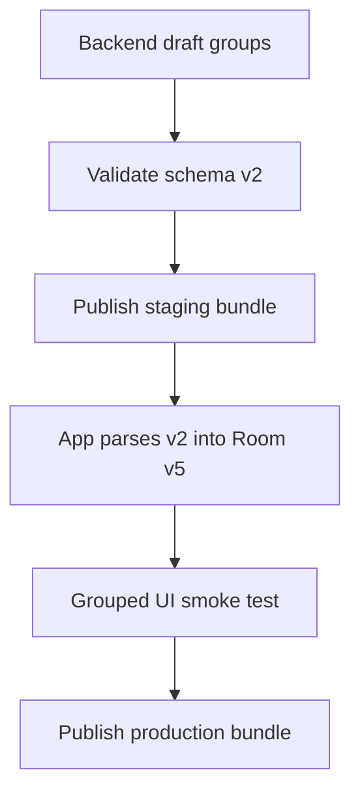

# Backend — Command Groups Schema v2

**mob_id:** MOB-20260626-001 · **Дата:** 2026-06-29 · **Статус:** **реализовано** (backend + admin UI + pilot seed)

Цель: дать app каноническую data-driven структуру для плотной группировки похожих команд. Backend — источник правды для смысловых групп, порядка вариантов, preview-команд и search aliases.

Связанный app-план: [`APP-GROUPED-COMMANDS-UI.md`](https://github.com/MironBano/AliceCommands/blob/main/docs/APP-GROUPED-COMMANDS-UI.md) (AliceCommands repo).

**Документация backend:** [API.md](API.md) · [DATABASE.md](DATABASE.md) · [RUNBOOK-PUBLISH.md](RUNBOOK-PUBLISH.md) §10 · [ADMIN-UX.md](ADMIN-UX.md)

**Pilot seed:** [`seed/smart-home-groups-v2.json`](../seed/smart-home-groups-v2.json)

---

## 1. Why

Текущая content schema v1 описывает команды, категории и `related_command_ids`, но не описывает управляемые группы команд. Из-за этого app вынужден показывать плоские списки и сортировать по `titleRu ASC`.

Новая модель должна позволить:

- группировать похожие команды рядом: `Свет`, `Розетки`, `Климат`, `Громкость`;
- управлять порядком групп и команд editorial-данными;
- показывать compact UI без эвристик в Android;
- строить preview-команды в каталоге;
- улучшить поиск через aliases без дублирования команд;
- сохранить стабильные `command.id` для favorites/history/widget/checklist.

---

## 2. Contract Shift

| Сейчас schema v1 | Нужно schema v2 |
| ---------------- | --------------- |
| `commands[]` flat | `command_groups[]` + `commands[].group_id` |
| `commands` sorted client-side by title | `group.sort_order` + `command.sort_order` |
| `related_command_ids` manual graph | Group membership as primary related context |
| `phrases[]` only for copy/TTS | `variant_label_ru` for compact row labels |
| FTS uses title/phrases/effect | FTS also uses `search_aliases[]` |

---

## 3. Target Bundle Shape

```json
{
  "schema_version": 2,
  "content_version": 19,
  "published_at": "2026-06-29T15:00:00Z",
  "min_app_version": "1.0",
  "categories": [],
  "command_groups": [
    {
      "id": "smart_home_light",
      "category_id": "smart_home",
      "title_ru": "Свет",
      "description_ru": "Включение, выключение и режимы освещения",
      "sort_order": 10,
      "icon_key": "lightbulb",
      "featured": true,
      "preview_command_ids": [
        "sh_light_on",
        "sh_light_off",
        "sh_light_dim"
      ]
    }
  ],
  "commands": [
    {
      "id": "sh_light_on",
      "category_id": "smart_home",
      "group_id": "smart_home_light",
      "sort_order": 10,
      "variant_label_ru": "Включи свет",
      "is_primary_in_group": true,
      "title_ru": "Включи свет",
      "phrases": [
        "Алиса, включи свет"
      ],
      "effect_description_ru": "Включит основной свет там, где это поддерживается.",
      "requires_alice_word": true,
      "requires_plus": false,
      "device_types": [
        "station",
        "phone"
      ],
      "related_command_ids": [],
      "search_aliases": [
        "освещение",
        "лампа",
        "люстра"
      ],
      "source_url": "https://...",
      "published_at": "2026-06-29T15:00:00Z",
      "updated_at": "2026-06-29T15:00:00Z",
      "tags": [
        "smart_home",
        "light"
      ]
    }
  ],
  "scenario_templates": [],
  "checklist_items": []
}
```

---

## 4. Field Semantics

### `command_groups[]`

| Поле | Тип | Обяз. | Описание |
| ---- | --- | ----- | -------- |
| `id` | string | yes | Stable slug. Не менять после публикации. |
| `category_id` | string | yes | FK на `categories.id`. |
| `title_ru` | string | yes | Заголовок группы в UI. |
| `description_ru` | string? | no | Короткая подсказка для expanded/detail/admin. |
| `sort_order` | int | yes | Порядок группы внутри категории. |
| `icon_key` | string? | no | Иконка группы; fallback на category icon. |
| `featured` | bool | no | Можно использовать для catalog previews. |
| `preview_command_ids` | string[] | no | Editorial preview для каталога. Если пусто, app берёт primary/top commands. |

### `commands[]` additions

| Поле | Тип | Обяз. | Описание |
| ---- | --- | ----- | -------- |
| `group_id` | string? | no | FK на `command_groups.id`; nullable для совместимости/legacy. |
| `sort_order` | int? | no | Порядок команды внутри группы. |
| `variant_label_ru` | string? | no | Короткий label для compact row. Fallback: `title_ru`. |
| `is_primary_in_group` | bool | no | Primary command для preview и collapsed state. |
| `search_aliases` | string[] | no | Синонимы для FTS без дублирования команд. |

---

## 5. Validation Rules

Backend publish должен валидировать:

1. `command_groups[].category_id` существует.
2. `commands[].group_id`, если задан, существует и принадлежит той же `category_id`.
3. В каждой группе есть минимум одна команда.
4. В группе не более одной `is_primary_in_group = true`; если нет primary, первая по `sort_order`.
5. `sort_order` задан для всех групп; для команд с `group_id` желательно задан.
6. `preview_command_ids` принадлежат той же группе.
7. `search_aliases` не содержат пустые строки и дублей с `phrases/title`.
8. `command.id` стабильны; grouping не должен переименовывать существующие команды.
9. Bundle gzip size остаётся в лимите из [app CONTENT-SCHEMA](https://github.com/MironBano/AliceCommands/blob/main/docs/CONTENT-SCHEMA.md).
10. `source_url` остаётся обязательным у команды.

---

## 6. Backend / Admin (реализовано)

### Storage (PostgreSQL draft, Flyway V4)

- Таблица `command_groups` + поля в `commands`: `group_id`, `sort_order`, `variant_label_ru`, `is_primary_in_group`, `search_aliases`
- Индексы: `(category_id, sort_order)` для groups; `(group_id, sort_order)` для commands

### Admin UI

- View **Группы команд**: CRUD, reorder **▲/▼** (не drag-and-drop)
- **Команды**: group fields, bulk assign to group
- Primary insight: `GET /admin/api/content/validation-warnings` — orphan commands, empty group, duplicate aliases

### Import / Parser Assist

Парсер не auto-publish groups. Может предлагать группы/aliases редактору; publish после human review. Pilot seed: `seed/smart-home-groups-v2.json`.

---

## 7. API Contract

Endpoints остаются совместимыми:

| Method | Path | Change |
| ------ | ---- | ------ |
| GET | `/v1/content/manifest` | `schema_version = 2`, `content_version`, checksum |
| GET | `/v1/content/bundle` | Добавить `command_groups[]` и новые поля commands |
| GET | `/v1/content/delta?from={v}` | Delta должен уметь добавлять/изменять groups |
| GET | `/v1/affiliate/blocks` | Без изменений |

Manifest compatibility:

- `min_app_version` поднимать только когда grouped UI становится обязательным.
- Пока app умеет fallback, можно публиковать schema v2 без форсирования обновления.
- Старые app версии с tolerant JSON parsing проигнорируют `command_groups`, но сохранят flat commands.

---

## 8. App Compatibility Contract

Backend обязан поддержать app fallback:

- У каждой команды остаются `category_id`, `title_ru`, `phrases`, `effect_description_ru`, `source_url`.
- `group_id` nullable.
- `related_command_ids` временно сохраняются для старого UI/detail.
- `tags` сохраняются для quick tab и обратной совместимости.
- `preview_command_ids` не обязательны.

App обязан:

- если `command_groups` пуст, построить single-command groups;
- если command ссылается на неизвестную группу, показать её flat и логировать validation issue;
- не менять favorites/history/widget keys при regrouping.

---

## 9. Editorial Guidelines

Группа — это пользовательская задача, а не технический тег.

Хорошие группы:

- `Свет`: включить/выключить/приглушить/ночник/режимы;
- `Розетки`: включить/выключить/таймер/устройство;
- `Климат`: кондиционер/обогреватель/температура;
- `Громкость`: громче/тише/процент/без звука;
- `Каналы ТВ`: включить канал/переключить/номер канала.

Плохие группы:

- `quick` — это тег/поверхность, не смысловая группа;
- `station` — это device filter;
- `new` — это badge;
- слишком широкие группы вроде `Умный дом`, если внутри 50+ команд.

Размер:

- ideal: 4–8 команд;
- acceptable: 2–12 команд;
- если больше 12, разделить на подзадачи или использовать collapsed sections.

---

## 10. Migration Strategy



Step-by-step:

1. Добавить schema v2 docs + JSON Schema.
2. Добавить DB/admin model in backend.
3. Сгруппировать pilot `smart_home`.
4. Выпустить staging bundle `schema_version = 2`.
5. App реализует Room v5 + grouped UI fallback.
6. Проверить staging на Android.
7. Сгруппировать остальные категории.
8. Включить production bundle.

---

## 11. Backend Tests

Минимальный набор:

- JSON Schema validation for schema v2.
- Unit tests для validator:
  - unknown `category_id`;
  - unknown/wrong-category `group_id`;
  - empty group;
  - duplicate primary;
  - invalid preview command;
  - duplicate aliases.
- Bundle builder snapshot test.
- Manifest checksum test.
- Delta patch test для group create/update/delete.
- Admin publish integration test.

---

## 12. Observability

Backend publish logs:

- `content_publish_started`;
- `content_validation_failed`;
- `content_bundle_built`;
- `content_manifest_updated`;
- `content_publish_rolled_back`.

Bundle metadata:

- `schema_version`;
- `content_version`;
- count categories/groups/commands;
- gzip size;
- checksum.

App analytics will validate UX outcomes; see [APP-GROUPED-COMMANDS-UI.md](https://github.com/MironBano/AliceCommands/blob/main/docs/APP-GROUPED-COMMANDS-UI.md) §10.

---

## 13. Open Decisions (зафиксировано 2026-06-29)

| Вопрос | Решение |
| ------ | ------- |
| Nested groups | **Один уровень** `command_groups` (без subsections) |
| `related_command_ids` | **Ручной override** сохранён; group membership — primary context |
| Category preview | **`command_groups.preview_command_ids`** |
| `group_command_count` | App считает сам (не в API) |
| `min_app_version` | **1.0** до релиза grouped UI в app |

---

## 14. Definition Of Done

- [x] Schema v2 в JSON Schema + backend docs
- [x] Backend генерирует валидный bundle с `command_groups`
- [x] Flyway V4, admin CRUD, publish validation, delta endpoint
- [x] Pilot seed `smart-home-groups-v2.json`
- [x] Staging **published** bundle schema v2 (import + publish ops)
- [ ] App grouped UI QA на staging (AliceCommands)

---

## 15. Реализовано в коде

| Компонент | Путь |
| --------- | ---- |
| Migration | `server/.../db/migration/V4__command_groups.sql` |
| Models | `domain/Models.kt` — `CommandGroup`, bundle v2 |
| Validation | `CommandGroupValidationUseCase.kt` |
| Delta | `ContentDeltaService.kt`, `GET /v1/content/delta` |
| Admin API | `AdminRoutes.kt` — `/command-groups/*`, bulk-assign |
| Admin UI | `admin-web` — view «Группы команд» |
| Tests | `CommandGroupValidationTest.kt`, `ContentDeltaTest.kt` |

---

*Backend contract + реализация. Android UI — [`APP-GROUPED-COMMANDS-UI.md`](https://github.com/MironBano/AliceCommands/blob/main/docs/APP-GROUPED-COMMANDS-UI.md).*
