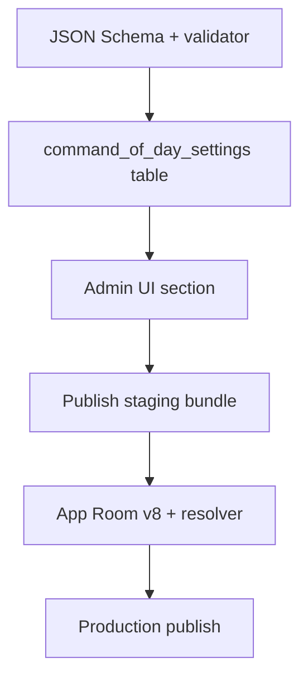

# Backend Plan — Command of Day (editorial)

**mob_id:** MOB-20260626-001 · **Дата:** 2026-07-01 · **Статус:** реализовано (staging v20, 2026-07-02)

Цель: сделать **«команду дня» editorial-объектом** в content bundle. Редактор в админке выбирает команду по `id` (ручной режим) или включает автоперебор команд внутри категории. Клиенты после sync показывают ту же команду; при offline и смене календарного дня автоперебор детерминированно пересчитывается по общему алгоритму.

Связанный app-план: [`APP-COMMAND-OF-DAY.md`](APP-COMMAND-OF-DAY.md).

Backend repo: [`alice-commands-api`](https://github.com/MironBano/alice-commands-api). При работе в backend-проекте синхронизировать с `docs/API.md`, `docs/BACKEND-REQUIREMENTS.md`, `docs/RUNBOOK-PUBLISH.md`, `schema/content-bundle.schema.json`.

---

## 1. Why

| Сейчас (app) | Проблема |
| ------------ | -------- |
| `GetCommandOfDayUseCase` — hash по `DAY_OF_YEAR` из **всех** команд | Нет editorial control |
| Пул = весь каталог | Нельзя продвигать тематику (музыка, УД, сезон) |
| Смена только при изменении набора `command.id` | Непредсказуемо для редакции |
| Нет поля в bundle | Нарушает принцип «backend = источник истины» ([`CONTENT-PIPELINE.md`](CONTENT-PIPELINE.md) §1.1) |

После реализации:

- Редактор **вручную** закрепляет команду дня по `command_id`.
- Или включает **auto** — ежедневный перебор команд одной категории.
- Bundle содержит policy + snapshot на дату публикации.
- App без сети после полуночи пересчитывает auto локально тем же алгоритмом.

---

## 2. Contract Shift

| Сейчас | Нужно |
| ------ | ----- |
| Команда дня не в bundle | Корневой объект `command_of_day` в content bundle |
| Клиентский hash по всему каталогу | `mode: manual \| auto` + FK на command/category |
| — | Snapshot `resolved_date` + `command_id` при publish |
| — | Общий resolver в backend (bundle build) и app (offline rollover) |

**`schema_version` не поднимать** — optional root field, как visual fields в schema v2. Старые app с tolerant JSON parsing игнорируют поле.

---

## 3. Target Bundle Shape

```json
{
  "schema_version": 2,
  "content_version": 42,
  "published_at": "2026-07-01T09:00:00Z",
  "min_app_version": "1.0",
  "categories": [],
  "command_groups": [],
  "commands": [],
  "scenario_templates": [],
  "checklist_items": [],
  "command_of_day": {
    "mode": "manual",
    "command_id": "sh_light_on",
    "auto_category_id": null,
    "auto_seed": 31,
    "resolved_date": "2026-07-01",
    "updated_at": "2026-07-01T08:55:00Z"
  }
}
```

Пример auto:

```json
"command_of_day": {
  "mode": "auto",
  "command_id": "music_play_favorite",
  "auto_category_id": "music",
  "auto_seed": 31,
  "resolved_date": "2026-07-01",
  "updated_at": "2026-07-01T08:55:00Z"
}
```

`command_id` в auto — **денормализованный snapshot** команды на `resolved_date` (для preview в админке и fast path в app). Не дублирует `commands[]`.

---

## 4. Field Semantics

### `command_of_day` (корень bundle, optional → если отсутствует, app использует legacy fallback)

| Поле | Тип | Обяз. | Описание |
| ---- | --- | ----- | -------- |
| `mode` | string | yes | `manual` — закреплена редактором; `auto` — перебор по категории |
| `command_id` | string | yes | ID команды. Manual: выбранная редактором. Auto: snapshot на `resolved_date` |
| `auto_category_id` | string? | if auto | FK `categories.id`. Пул = все команды категории |
| `auto_seed` | int | no | Seed детерминированного индекса. Default **31** (совместимость с legacy multiplier) |
| `resolved_date` | string | yes | `YYYY-MM-DD`, календарь **Europe/Moscow** |
| `updated_at` | ISO-8601 | yes | Когда редактор последний раз менял настройку (не дата команды) |

### Поведение режимов

| Режим | Когда меняется команда | Кто выбирает |
| ----- | ---------------------- | ------------ |
| `manual` | Только когда редактор меняет `command_id` или переключает режим | Редактор |
| `auto` | Каждый календарный день (Europe/Moscow) | Алгоритм §5 по пулу категории |

**Manual:** `command_id` остаётся неизменным между днями, пока редактор не опубликует новую настройку. `resolved_date` — метка publish, app **не** использует её для смены manual-команды.

**Auto:** при каждом publish backend пересчитывает `command_id` для `resolved_date = today(Moscow)`. Между publish app сам пересчитывает на новый день offline (см. app-план §6).

---

## 5. Auto Resolver (канонический алгоритм)

Backend bundle builder и Android **обязаны** использовать одну функцию.

### Пул

Команды, где `commands[].category_id == auto_category_id`, отсортированы:

1. `sort_order ASC` (NULL → `2147483647`)
2. `id ASC` (tie-break)

Тот же порядок, что в app `ContentDao.observeCommands(categoryId)`.

### Индекс

```
date       = LocalDate в Europe/Moscow (для resolved_date — parse "YYYY-MM-DD")
epochDay   = date.toEpochDay()          // proleptic ISO, без time-of-day
poolSize   = pool.size
seed       = auto_seed ?: 31
index      = ((epochDay * seed) + poolSize) % poolSize   // non-negative
command_id = pool[index].id
```

### Свойства

- Детерминирован: одинаковый результат на backend и app.
- Стабилен при добавлении команд в конец пула (индексы прошлых дней не «ломаются» полностью, в отличие от сортировки по `title`).
- При изменении состава пула (удаление команды) индексы сдвигаются — **publish validation** должен предупреждать.

### Legacy fallback (только app, до появления поля в bundle)

Текущий клиентский алгоритм (весь каталог, `DAY_OF_YEAR`) — см. [`APP-COMMAND-OF-DAY.md`](APP-COMMAND-OF-DAY.md) §8. Backend **не** реализует legacy.

---

## 6. Validation Rules (publish)

Добавить к существующему validator:

1. Если `command_of_day` присутствует:
   - `mode` ∈ `{ manual, auto }`.
   - `command_id` непустой, существует в `commands[]`.
   - `resolved_date` — regex `^\d{4}-\d{2}-\d{2}$`, валидная дата.
   - `updated_at` — валидный ISO-8601.
   - `auto_seed` ≥ 1 (если задан).
2. `mode = manual`:
   - `auto_category_id` должен быть `null` (reject if set).
   - `command_id` может быть из любой категории.
3. `mode = auto`:
   - `auto_category_id` обязателен, существует в `categories[]`.
   - Пул категории ≥ 1 команда.
   - `command_id` **должен совпадать** с результатом resolver для `resolved_date` (иначе reject — защита от рассинхрона).
4. Удаление команды, используемой как manual `command_id`, блокирует publish (или admin warning → hard fail).
5. Удаление последней команды из `auto_category_id` при `mode = auto` блокирует publish.
6. Bundle gzip size — лимит из [`CONTENT-SCHEMA.md`](CONTENT-SCHEMA.md).

**Мягкие warnings (не блокируют):**

- Auto-пул < 3 команд — мало разнообразия.
- Одна и та же manual-команда > 14 дней (`updated_at`).

---

## 7. Storage / Admin Changes

### PostgreSQL (draft model)

Таблица-синглтон `command_of_day_settings` (одна строка, `id = 1`):

| Колонка | Тип | Описание |
| ------- | --- | -------- |
| `mode` | VARCHAR | `manual` \| `auto` |
| `command_id` | TEXT | FK → `commands.id` |
| `auto_category_id` | TEXT NULL | FK → `categories.id` |
| `auto_seed` | INT NOT NULL DEFAULT 31 | |
| `updated_at` | TIMESTAMPTZ | Последнее сохранение в админке |
| `updated_by` | TEXT NULL | Admin user id/email |

Индексы не нужны (1 row). FK на `commands` и `categories` — ON DELETE RESTRICT.

**Миграция данных:** при первом deploy таблица пустая; строка создаётся **lazy** в `ExposedDraftRepository.ensureCommandOfDaySettingsInternal()` — `mode = auto`, `auto_category_id` = `music` → первая featured → первая категория, `command_id` через resolver на today (Moscow).

**Staging (2026-07-02):** редактор выбрал **`auto` + категория `obscure`** («Неочевидные команды», 34 команды). Опубликовано **content_version=20**; snapshot: `obscure_disko_podsvetka` на `2026-07-02`.

### Bundle builder

При `Publish`:

1. Прочитать `command_of_day_settings`.
2. `resolved_date = LocalDate.now(ZoneId.of("Europe/Moscow"))`.
3. Если `mode = auto` — `command_id = resolve(pool, resolved_date, auto_seed)`.
4. Записать объект `command_of_day` в корень JSON.
5. Остальной pipeline без изменений (gzip, sha256, manifest).

**Cron не нужен:** ежедневная смена auto-команды между publish обеспечивается app resolver'ом. Publish нужен только при смене policy или каталога.

### Admin UI

Новый раздел **«Команда дня»** (отдельная страница или блок в dashboard):

| Элемент | Поведение |
| ------- | --------- |
| Mode toggle | `Ручной` / `Авто` |
| Command picker (manual) | Поиск по `id`, `title_ru`; preview фразы + категория |
| Category select (auto) | Dropdown `categories[]`; показать `command_count` |
| Preview «Сегодня» | Title + phrase первой фразы для текущего resolver-результата |
| Preview «7 дней» (auto) | Таблица дата → команда (client-side resolver в админке) |
| Save draft | Пишет в `command_of_day_settings`, **не** publish |
| Publish | Существующий flow + validation §6 |

**UX-правила:**

- Переключение manual → auto: сразу показать preview сегодняшней auto-команды (может отличаться от manual pin).
- Переключение auto → manual: предзаполнить picker последней показанной auto-командой (удобство, не обязательство).
- Badge «Закреплено вручную» если `mode = manual` и `updated_at` < 7 дней.

### Admin API (draft CRUD)

Если admin уже использует REST для draft entities — добавить:

| Method | Path | Body / Response |
| ------ | ---- | --------------- |
| GET | `/admin/command-of-day` | Текущие settings + computed preview |
| PUT | `/admin/command-of-day` | `{ mode, command_id?, auto_category_id?, auto_seed? }` |

Auth: существующий admin session. Read API (`/v1/content/*`) **без изменений путей**.

---

## 8. API Contract

| Method | Path | Change |
| ------ | ---- | ------ |
| GET | `/v1/content/manifest` | Без изменений |
| GET | `/v1/content/bundle` | Optional `command_of_day` в корне |
| GET | `/v1/content/delta?from={v}` | Delta патчит / добавляет `command_of_day` |
| GET | `/v1/affiliate/blocks` | Без изменений |

`min_app_version` поднимать **только** если нужно отключить app без поддержки `command_of_day` (не требуется для launch).

---

## 9. JSON Schema

Файл `schema/content-bundle.schema.json` — добавить:

```json
"command_of_day": {
  "type": "object",
  "required": ["mode", "command_id", "resolved_date", "updated_at"],
  "properties": {
    "mode": { "enum": ["manual", "auto"] },
    "command_id": { "type": "string", "minLength": 1 },
    "auto_category_id": { "type": ["string", "null"] },
    "auto_seed": { "type": "integer", "minimum": 1, "default": 31 },
    "resolved_date": { "type": "string", "pattern": "^\\d{4}-\\d{2}-\\d{2}$" },
    "updated_at": { "type": "string", "format": "date-time" }
  },
  "if": { "properties": { "mode": { "const": "auto" } } },
  "then": { "required": ["auto_category_id"] }
}
```

Синхронизировать копию в app repo при необходимости CI validation.

---

## 10. Editorial Guidelines

| Сценарий | Рекомендация |
| -------- | ------------ |
| Запуск фичи / партнёрство | `manual`, 3–7 дней одна команда |
| Обычная неделя | `auto` по ротационной категории (музыка, развлечения, УД) |
| Праздник | `manual` с тематической командой |
| Новая категория | Неделя `auto` по этой категории |

Auto-категория: **8+ команд** для заметного разнообразия; ideal 15–40.

Не использовать auto по всему каталогу (эквивалент legacy) — для этого есть `auto_category_id` только одной категории.

---

## 11. Migration Strategy



Step-by-step:

1. Добавить schema + `CommandOfDayResolver` unit tests в backend.
2. Миграция PostgreSQL + seed row (auto, pilot category).
3. Admin UI + PUT/GET endpoints.
4. Bundle builder: emit `command_of_day`.
5. Publish staging → проверить curl + app из [`APP-COMMAND-OF-DAY.md`](APP-COMMAND-OF-DAY.md).
6. Первая manual-кампания или auto по выбранной категории (staging: **`obscure`**).
7. Production publish.
8. Обновить [`CONTENT-SCHEMA.md`](CONTENT-SCHEMA.md) §2 и [`CONTENT-PIPELINE.md`](CONTENT-PIPELINE.md) §1.1 (строка «Команда дня»).

**Rollback:** republish предыдущий `content_version` без `command_of_day` или со старыми settings; app откатится на legacy fallback.

---

## 12. Backend Tests

| Тест | Сценарий |
| ---- | -------- |
| JSON Schema | valid manual / valid auto / missing fields |
| Resolver unit | пустой пул → error; стабильность на одну дату; смена даты |
| Resolver unit | порядок `sort_order`, tie-break `id` |
| Validator | manual + `auto_category_id` set → reject |
| Validator | auto + `command_id` ≠ resolver → reject |
| Validator | `command_id` not in commands → reject |
| Bundle builder snapshot | object present, `resolved_date` = today Moscow |
| Delta patch | update only `command_of_day` |
| Admin integration | PUT manual → publish → bundle contains id |

---

## 13. Observability

Publish logs (дополнить metadata):

- `command_of_day_mode`
- `command_of_day_command_id`
- `command_of_day_auto_category_id`
- `command_of_day_resolved_date`

Admin audit log:

- `command_of_day_updated` с `mode`, `command_id`, `auto_category_id`, `updated_by`.

---

## 14. Open Decisions

| Вопрос | Рекомендация v1 | Отложить |
| ------ | --------------- | -------- |
| Пул auto = категория или группа? | **Категория** (проще, покрывает запрос) | `auto_group_id` в v1.1 |
| Явный whitelist `auto_command_ids[]`? | Нет | Если нужен curated пул без всей категории |
| Расписание на 30 дней в bundle? | Нет — resolver достаточен | Editorial calendar v1.1 |
| Timezone | **Europe/Moscow** fixed | User locale — не нужно |

---

## 15. Definition Of Done

- [x] `command_of_day` в JSON Schema и staging bundle (v20).
- [x] Admin: ручной выбор команды по id + auto по категории.
- [x] Publish validation §6 green.
- [x] Resolver покрыт unit tests, совпадает с app (shared test vectors в §16).
- [x] `docs/API.md` и `RUNBOOK-PUBLISH.md` обновлены.
- [ ] App smoke на staging ([`APP-COMMAND-OF-DAY.md`](APP-COMMAND-OF-DAY.md) DoD) — backend готов, ждёт app sync QA.

---

## 16. Shared Test Vectors (backend ↔ app)

Использовать в unit tests обоих репозиториев:

| `auto_category_id` | pool (id, sort_order) | `date` | `seed` | expected `command_id` |
| ------------------ | --------------------- | ------ | ------ | --------------------- |
| `test_cat` | a/1, b/2, c/3 | 2026-07-01 | 31 | `b` |
| `test_cat` | a/1, b/2, c/3 | 2026-07-02 | 31 | `c` |
| `test_cat` | a/1, b/1, c/2 | 2026-07-01 | 31 | tie-break: `a` before `b` по `id` |

При первой реализации сгенерировать expected значения из reference implementation (Kotlin `CommandOfDayResolver`) и закоммитить в оба repo.

---

*Этот документ фиксирует backend contract. Android реализация — [`APP-COMMAND-OF-DAY.md`](APP-COMMAND-OF-DAY.md).*
