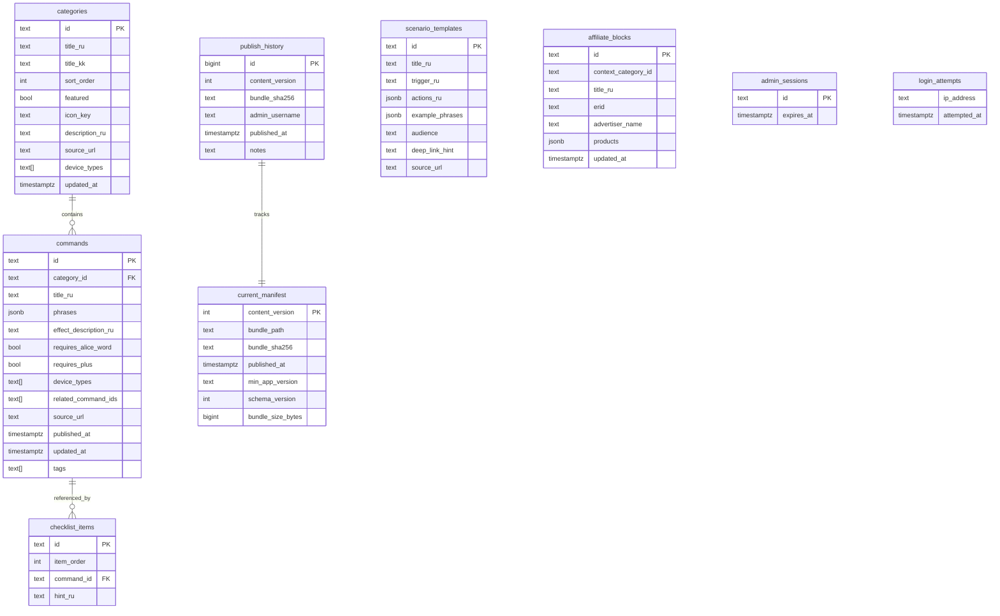

# Database — alice-commands-api

**DBMS:** PostgreSQL 16 · **Migrations:** Flyway (`server/src/main/resources/db/migration/V1__init.sql`)

---

## 1. Принцип

- **Draft** таблицы (`categories`, `commands`, …) — mutable, редактируются admin
- **Published** state — files (`content_vN.json.gz`) + row `current_manifest` + affiliate snapshot на диске
- Publish читает draft → валидирует schema → пишет bundle

---

## 2. ERD (упрощённо)



---

## 3. Indexes

```sql
CREATE INDEX idx_commands_category ON commands(category_id);
CREATE INDEX idx_commands_tags ON commands USING GIN(tags);
CREATE INDEX idx_categories_sort ON categories(sort_order);
CREATE INDEX idx_login_attempts_ip ON login_attempts(ip_address, attempted_at);
CREATE INDEX idx_checklist_order ON checklist_items(item_order);
```

---

## 4. Publish state

| Table / storage | Role |
| --------------- | ---- |
| `current_manifest` | Pointer to live bundle (single active row) |
| `publish_history` | Audit + rollback source (last 5 on disk) |
| `storage/bundles/` | `content_v{N}.json.gz` files |
| `storage/manifest/` | Affiliate snapshot для public endpoint |

Rollback: update `current_manifest` to previous `content_version` where bundle file still exists.

---

## 5. Seed / import

| Файл | Назначение |
| ---- | ---------- |
| `seed/import-smart-home.json` | Pilot Умный дом (первый dev publish) |
| `seed/full-catalog.json` | Output `tools/content/build_bundle.py` |

Import через admin UI или `POST /admin/api/import/json?mode=merge|replace`.

---

## 6. Backup

- `pg_dump` weekly (cron on VPS)
- Bundle files в storage backup или regenerable через re-publish из draft

---

## 7. Local dev

```yaml
# docker-compose.yml
POSTGRES_DB: alice_commands
POSTGRES_USER: alice
POSTGRES_PASSWORD: alice_dev
```

Flyway применяется автоматически при старте Ktor.

---

*Field mapping → [schema/content-bundle.schema.json](../schema/content-bundle.schema.json)*
