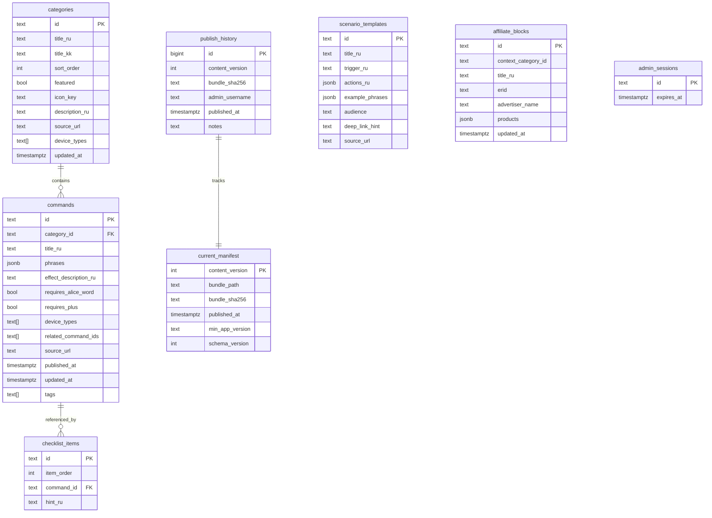

# Database — alice-commands-api

**DBMS:** PostgreSQL 16 · **Migrations:** Flyway

---

## 1. Принцип

- Все **draft** таблицы — mutable, редактируются admin
- **Published** state — только files (`content_vN.json.gz`) + row `current_manifest`
- Publish читает draft → пишет bundle

---

## 2. ERD (упрощённо)



---

## 3. Indexes

```sql
CREATE INDEX idx_commands_category ON commands(category_id);
CREATE INDEX idx_commands_tags ON commands USING GIN(tags);
CREATE INDEX idx_categories_sort ON categories(sort_order);
```

---

## 4. Publish state

| Table | Role |
| ----- | ---- |
| `current_manifest` | Single row (or versioned) — pointer to live bundle |
| `publish_history` | Audit + rollback source |

Rollback: update `current_manifest` to previous `content_version` where bundle file still exists.

---

## 5. Seed

Import from [`seed/import-smart-home.json`](../seed/import-smart-home.json) via admin import or Flyway seed script (dev only).

---

## 6. Backup

- `pg_dump` weekly (cron on VPS)
- Bundle files included in storage backup or regenerable from DB via re-publish

---

*Field mapping → [schema/content-bundle.schema.json](../schema/content-bundle.schema.json)*
